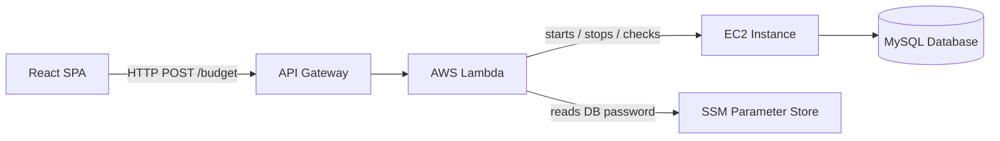
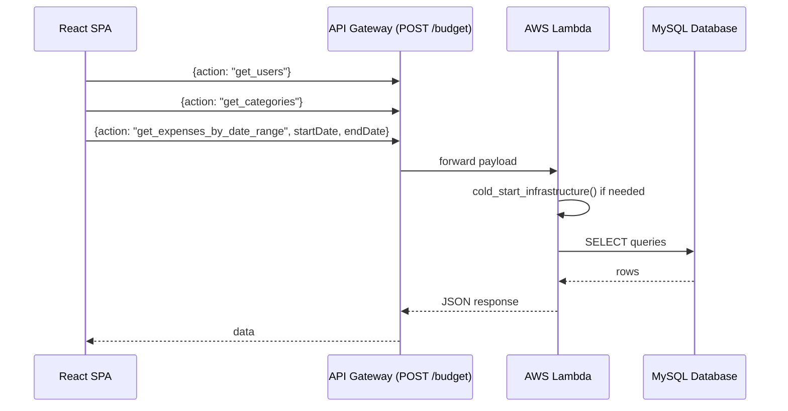
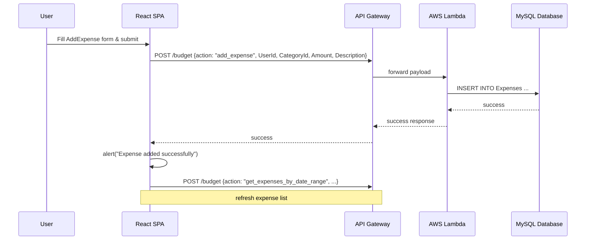
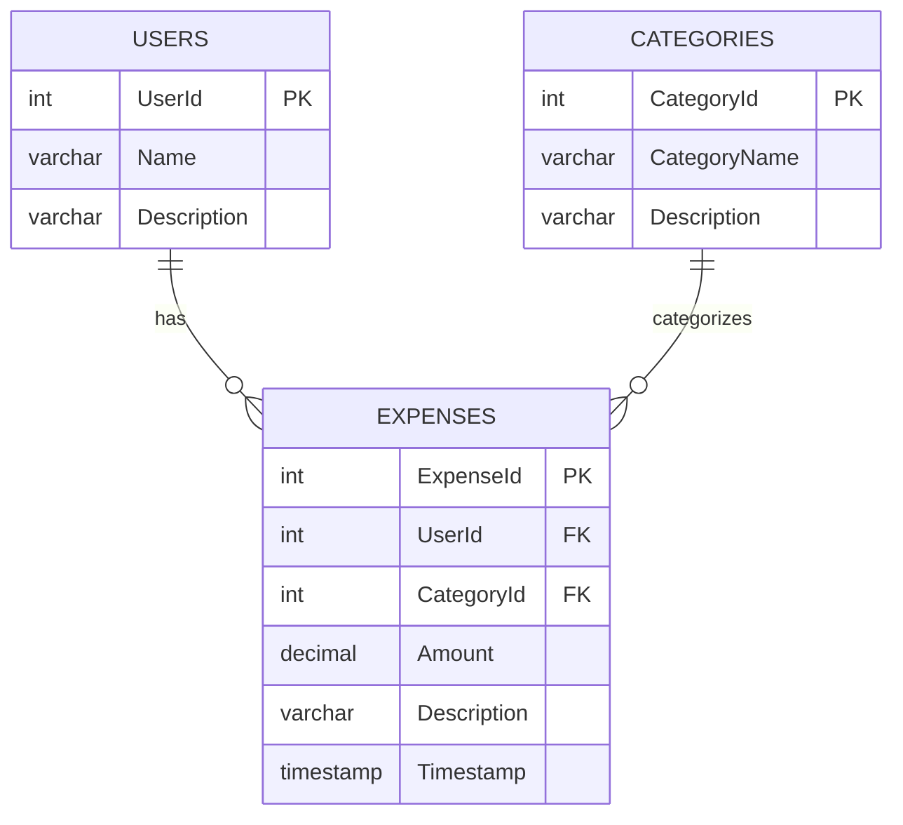
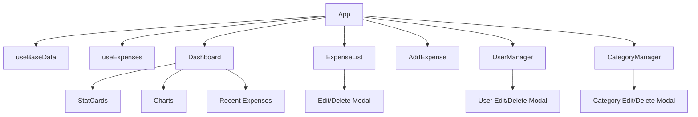
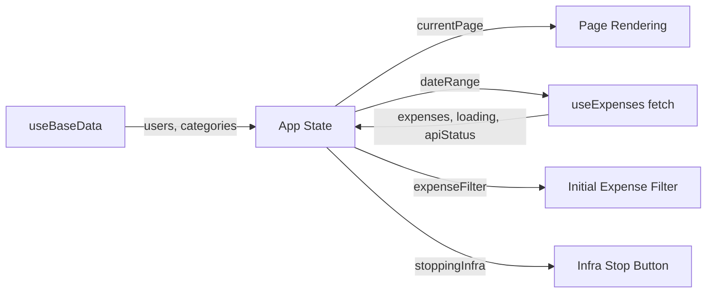

# Budget Tracker – Mermaid Diagrams

This file contains Mermaid diagrams that summarize the architecture and data flows described in `context.md`.

## High‑Level Architecture

## Initial Load Sequence

## Expense CRUD Sequence (Add Expense Example)

## Database Schema

## React Component Hierarchy

## State Management Overview

